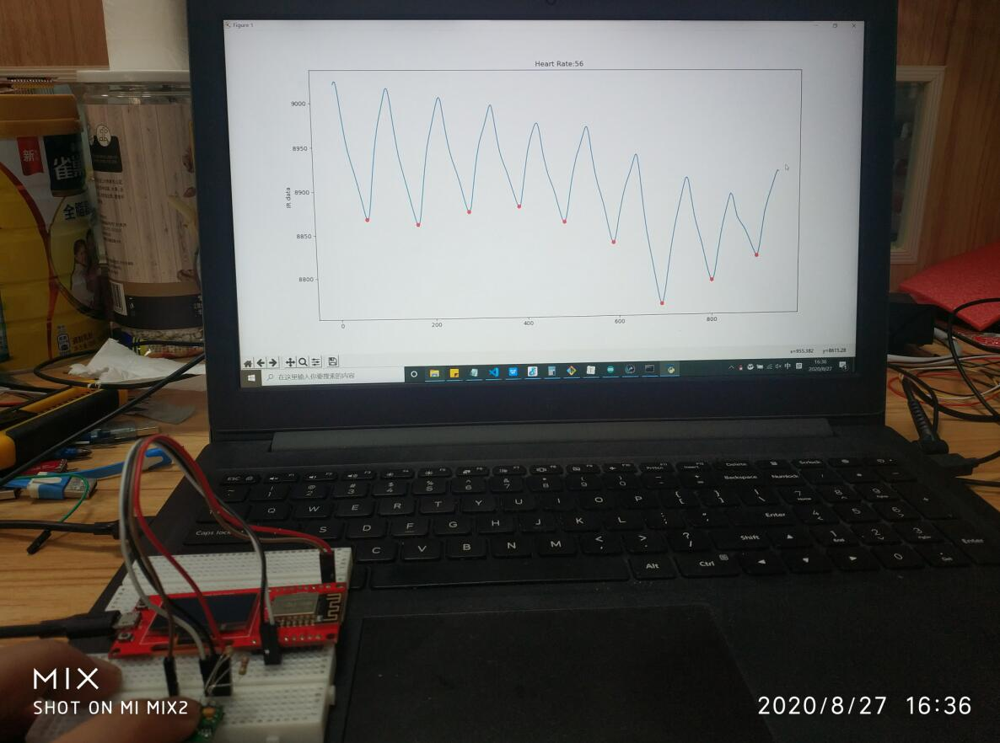
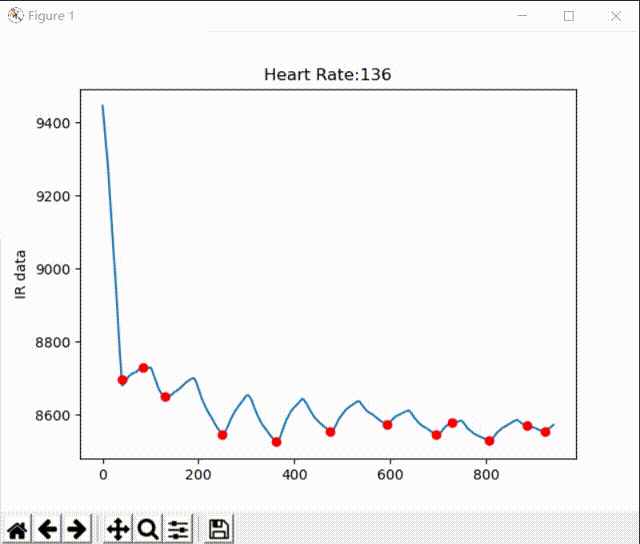
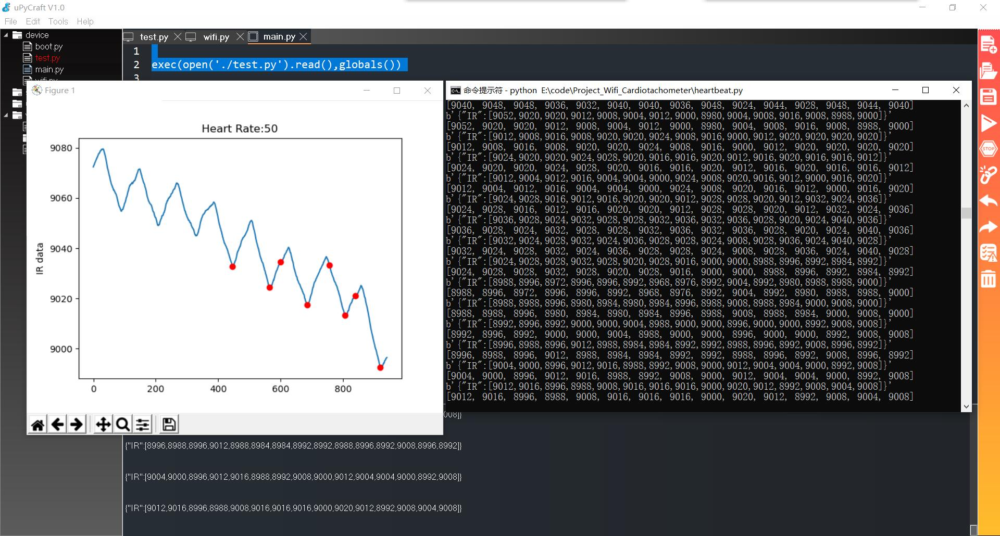

# MicroPython Wifi Cardiotachometer

```c++
/*
Version:		V1.0
Author:			Vincent
Create Date:	2020/8/27
Note:
*/
```




[toc]

# OVERVIEW

## Intruduce

[Makerfabs home page](https://www.makerfabs.com/)

[Makerfabs Wiki](https://makerfabs.com/wiki/index.php?title=Main_Page)

The MAX30100 is a sensor that can read heart rate and blood oxygen. The communication mode is through IIC.Its working principle is that the ADC value of heart rate can be obtained by infrared LED light irradiation.
Python is used in both upper and lower computers of this project.This project USES MakePython ESP8266 as the MCU to read the blood oxygen sampling value of MAX30100 and transmit it to PC via wifi.On the PC side, data is analyzed by a simple Python upper computer.The heart rate is calculated by simple mean filtering and peak and trough detection algorithms, and is displayed through graphical interface.

And it also can use ESP32 ,if you change I2C pins number.


## Equipment list

- [MakePython ESP8266](https://www.makerfabs.com/makepython-esp8266.html?search=8266)
- [MAX30100](https://www.makerfabs.com/max30100-pulse-oximeter-spo2-and-heart-rate-sensor-module.html?search=MAX30100)


# STEPS

## Connect MAX30100 to ESP8266

- Wire MAX30100 vin, GND, SDA, and SCL to ESP8266's 3.3V, GND, SDA, and SCL, respectively.


## Prepare And Burn

**If you have any questions，such as how to install the development board, how to download the code, how to install the library. Please refer to :[Makerfabs_FAQ](https://github.com/Makerfabs/Makerfabs_FAQ)**

- Connect ESP8266 to PC .
- You need change some code like wifi config in "/Project_Wifi_Cardiotachometer/py8266/workSpace/wifi.py"

```python
SSID = "Makerfabs"      #Modify here with SSID
PASSWORD = "20160704"   #Modify here with PWD
```

- Get your PC Lan IP, like use "ipcongfig" command, and change code in "/Project_Wifi_Cardiotachometer/py8266/workSpace/test.py"

```python
def main():
  wifi.connect()
  ip_port = ('192.168.1.125', 80)
  client = socket.socket(socket.AF_INET,socket.SOCK_DGRAM)
```

- Use uPyCraft upload all file in "/Project_Wifi_Cardiotachometer/py8266/workSpace/"

## Prepare Upper Computer Software

- Change code in car_racing.py , change ip port to your own Lan IP.

```python
#udp init
import socket
BUFSIZE = 1024
ip_port = ('192.168.1.125', 80)
server = socket.socket(socket.AF_INET, socket.SOCK_DGRAM)  # udp
server.bind(ip_port)
```

- Use command line run: python /Project_Wifi_Cardiotachometer/heartbeat.py

- Reset ESP8266.

- Wait seconds , ESP8266 need connect wifi.
- Place your finger in the MAX30100 sensor area.


- The screen displays the bleeding oxygen curve and shows the heart rate.



# Code Explain

## PC

### heartbeat.py

- UDP server, receive IR data from ESP8266.

```python
# udp set
# Set server port
ip_port = ('192.168.1.125', 80)
# Set udp
server = socket.socket(socket.AF_INET, socket.SOCK_DGRAM)
# Set bind mod
server.bind(ip_port)
```

- Draw heartbeat plot.



```python
plt.clf()
plt.title("Heart Rate:" + str(heart_rate))
plt.ylabel("IR data")

temp_x = np.arange(len(avg_list_y))
plt.plot(temp_x, temp_y)

#plt.ylim(Y_MID - y_width,Y_MID + y_width)

for temp in lowest_point_list:
    plt.plot(temp, avg_list_y[temp], "ro")

plt.draw()
plt.pause(0.001)
```

- Avg filter.


```python
def avg_filter(src_list, level):
    avg_list = []
    for i in range(len(src_list) - level + 1):
        temp = 0
        for j in range(level):
            temp += src_list[i + j]

        avg_list.append(temp / level)

    return avg_list
```

## ESP8266

MAX30100 driver change from [mfitzp/max30100](https://github.com/mfitzp/max30100)

### test.py

- Max30100 Class define. 


```python
class MAX30100(object):

    def __init__(self,
                 i2c=None,
                 mode=MODE_HR,
                 sample_rate=100,
                 led_current_red=11.0,
                 led_current_ir=11.0,
                 pulse_width=1600,
                 max_buffer_len=64
                 ):
```


- Main logic, read data from MAX30100 and send to pc.


```python
def main():
    mx30 = MAX30100()
    mx30.set_mode(MODE_SPO2)

    wifi.connect()
    ip_port = ('192.168.1.125', 80)
    client = socket.socket(socket.AF_INET, socket.SOCK_DGRAM)

    while True:
        json_str = "{\"IR\":["
        for i in range(data_list_len):
            mx30.read_sensor()
            json_str = json_str + str(mx30.ir)
            if i != data_list_len - 1:
                json_str = json_str + ","
            else:
                json_str = json_str + "]}"
        print(json_str)
        time.sleep(0.002)
        gc.collect()

        text = str(json_str)
        client.sendto(text.encode('utf-8'), ip_port)
        data, server_addr = client.recvfrom(BUFSIZE)
    pass
```


### wifi.py 

- ESP8266 wifi connect config.


```python
import network
import time

SSID = "Makerfabs"      #Modify here with SSID
PASSWORD = "20160704"   #Modify here with PWD
```


## Arduino Version

ESP8266 works with Arduino and was originally developed with the Arduino IDE.

In "/Project_Wifi_Cardiotachometer/8266MAX30100", contains the code to get MAX30100 through serial port.If you're interested, heartheart.py doesn't delete the part that displays the image through the serial port.


